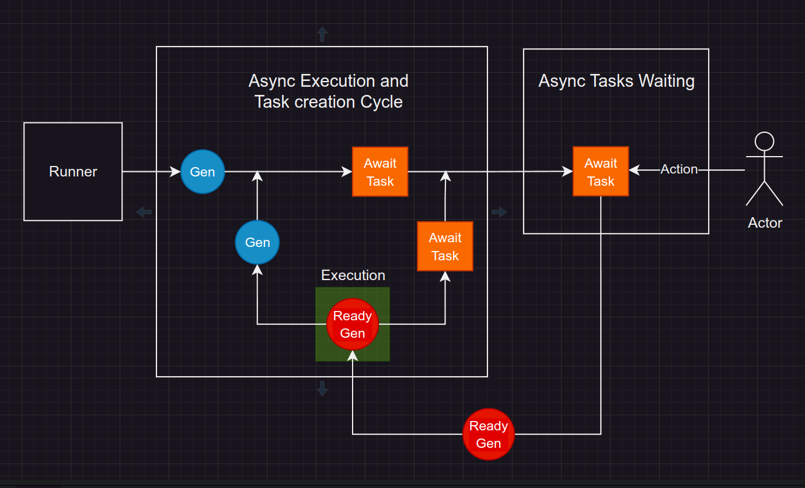

# Coroutine, Threading, Multiprocessing

### Multiprocessing is Celery + Celery Queue

### Threading
   * low Performance because of thread switching cost
   * GUL 5ms mechanism

### Coroutine 
    * Runs within a 1 main thread and in event loop, GIL doesn't affect
    * Is cheap to start
    * Is easy to get return value
    * Pre info about blocking function received by yield or await
    * Select as async waiting mechanism 

